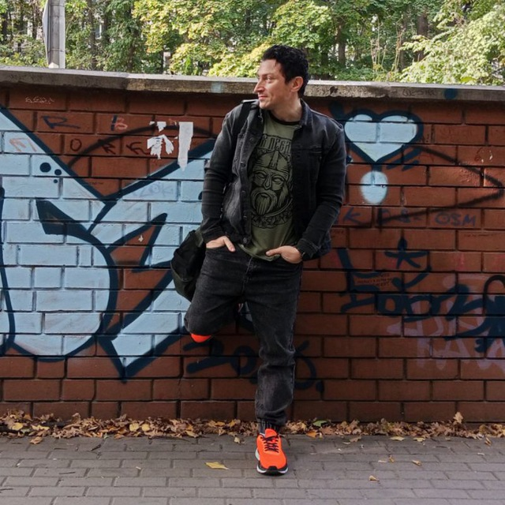

## Меня зовут Рустам. 

Я начинающий тестировщик ПО, учусь в Нетологии и осваиваю:
- Ручное тестирование
- Git и GitHub
- Автоматизацию на Python/Java

## Мои навыки
- Составление тест-кейсов и баг-репортов
- Работа в Git и GitHub

## Моё фото

## Контакты
- GitHub: [Vinitto](https://github.com/Vinitto)
- Email: ваш-email@example.com